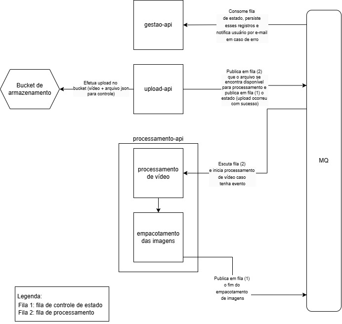

# 🎬 Fiap.FileCut - Sistema de conversão de vídeos em imagens

## 🚀 Descrição do Projeto

O **Fiap.FileCut** é um sistema de processamento de vídeos desenvolvido para atender demandas de escalabilidade e eficiência. Ele permite que usuários enviem vídeos, processem-nos e baixem um arquivo `.zip` contendo as imagens extraídas. Este projeto foi desenvolvido como parte de um desafio de arquitetura de software, implementando boas práticas de microsserviços, mensageria e qualidade de software.

### 🔧 Tecnologias Utilizadas
-   **Backend**: .NET 6.0
-   **Mensageria**:  RabbitMQ 🐇
-   **Armazenamento**: Amazon S3 ☁️
-   **Autenticação**: Keycloak 🔐
-   **CI/CD**:  GitHub Actions + SonarQube 🚀
-   **Testes**: xUnit + Moq + SpecFlow 🧪

## 💡 Motivação

O projeto originou-se de um protótipo simples para demonstrar a extração de imagens de vídeos. Embora funcional, esse código inicial carecia de boas práticas e uma arquitetura robusta.

Agora, o objetivo é transformar esse protótipo em uma solução completa e escalável, atendendo aos seguintes requisitos:

-   Suporte ao processamento simultâneo de múltiplos vídeos
-   Persistência de dados para controle e rastreamento de status
-   Tolerância a picos de carga sem perda de requisições
-   Sistema protegido por autenticação (usuário e senha)
-   Notificações aos usuários em caso de erro
-   Arquitetura escalável e garantia de qualidade por meio de testes e CI/CD

## 🏗️ Arquitetura

O sistema foi projetado seguindo o conceito de **microsserviços**. Cada componente tem uma responsabilidade específica:

**Microsserviços**:

1.  [Fiap.FileCut.Upload](https://github.com/Grupo-68-FIAP/Fiap.FileCut.Upload):
    -   Recebe os vídeos dos usuários
    -   Realiza o upload para um bucket de armazenamento, incluindo um arquivo JSON de controle
    -   Publica eventos de estado em filas (upload bem-sucedido ou falhas)
2.  [Fiap.FileCut.Gestao](https://github.com/Grupo-68-FIAP/Fiap.FileCut.Gestao):
    -   Gerencia o estado dos processos e armazena essas informações no banco de dados
    -   Notifica os usuários via e-mail ou outro meio em caso de falhas
3.  [Fiap.FileCut.Processamento](https://github.com/Grupo-68-FIAP/Fiap.FileCut.Processamento):
    -   Monitora eventos de processamento e inicia a extração de imagens dos vídeos
    -   Realiza a zipagem das imagens extraídas
    -   Publica eventos em filas indicando o progresso ou conclusão do processamento

**Outros componentes:**

1.  **Bucket de Armazenamento**:
    -   Armazena os vídeos enviados e os arquivos de controle
    -   Garante a integridade dos dados durante o fluxo todo
2.  **MQ (Message Queue)**:
    -   Gerencia a comunicação assíncrona entre os microsserviços
    -   As filas estão organizadas como:
        -   Fila 1: Controle de estado
        -   Fila 2: Processamento de vídeos
        -   Fila 3: Empacotamento de imagens

## 🧩 Visão Geral do Sistema

A arquitetura segue os princípios de DDD (Domain-Driven Design). Confira o [diagrama no Miro](https://miro.com/app/board/uXjVLw0z8YI=/?share_link_id=986601418356)! 🎨

## ⚙️ Como rodar projeto

Em breve! 🚧

## 🤝 Contribuição

Fique à vontade para contribuir! Abra issues e envie pull requests com melhorias ou correções. Toda ajuda é bem-vinda! 🌟

## 📄 Licença

Este projeto está licenciado sob a licença MIT.